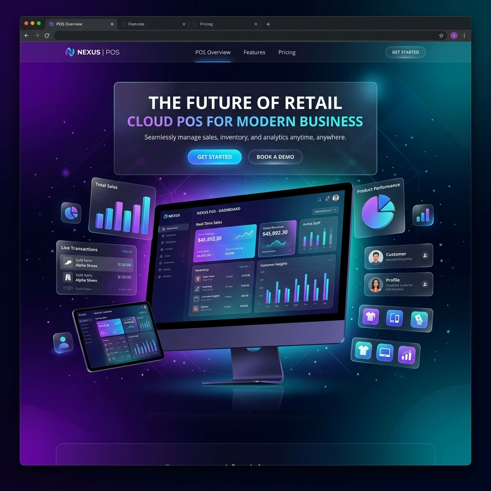

  
  
   
   

  # 🌟 Vels - Next Generation Point of Sale (POS)

  **Empower your retail business with an ultra-modern, cloud-based POS system.**  
  *Beautiful. Fast. Reliable. Built for scale.*

  

    
    
    
  

---

## ✨ Features That Shine

Vels POS redefines the checkout and retail management experience by blending top-tier aesthetics with blazing-fast performance.

- **🎨 Futuristic UI/UX**: Built with an emphasis on visual excellence, featuring glassmorphism, dynamic gradients, and a sleek dark mode.
- **⚡ Blazing Fast**: Real-time sync across your stores using a high-performance backend architecture.
- **📊 Advanced Analytics**: Comprehensive dashboards delivering key insights right to your fingertips.
- **🔒 Secure & Private**: State-of-the-art authentication and data encryption securing all transactions and customer data.
- **🚀 Cloud-Native**: Seamlessly scales from a single boutique to a global franchise.

---

## 🛠 Tech Stack

Our modern architecture relies on the industry's best tools:

| Category       | Technology |
| -------------- | ---------- |
| **Frontend**   | React, Next.js, Tailwind CSS |
| **Backend**    | Node.js, Express, TypeScript |
| **Database**   | PostgreSQL, Prisma ORM |
| **Architecture**| Turbo Monorepo |

---

## 📸 Sneak Peek

*Vels POS offers a visually stunning admin dashboard and lightning-fast checkout flow.*
> Note: The source code for Vels POS is proprietary and maintained in a private repository to ensure top-notch security for our clients.

---

## 🌍 Connect With Us

Interested in bringing Vels POS to your business?

- 💌 **Email**: [contact@vels-pos.app](mailto:contact@vels-pos.app)
- 🐦 **Twitter**: [@VelsPOS](https://twitter.com)
- 🌐 **Website**: [vels-pos.app](https://vels-pos.app)

---

  <i>Crafted with ❤️ by the Vels Team</i>

